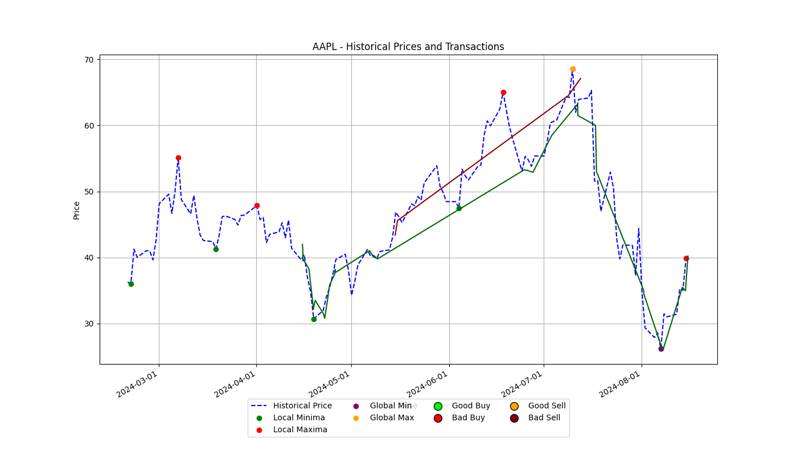

# Robinhood Stock Analyzer

A comprehensive tool for analyzing stock transactions and portfolio performance, specifically designed for integration with Robinhood. This project provides functionalities to filter and analyze stock trades, calculate outstanding stock quantities, and visualize historical stock prices. It integrates with Yahoo Finance to fetch current stock prices and plots various metrics to evaluate stock trading strategies and portfolio performance.

## Features

- **Transaction Filtering:** Filter and display stock transactions from a CSV file in a tabular format.
- **Total Analysis:** Analyze total bought and sold quantities for specific stocks.
- **Outstanding Stock Calculation:** Calculate outstanding stock quantities using FIFO order and assess profit/loss based on current prices.
- **Historical Data Visualization:** Fetch and plot historical stock prices, highlighting key buy/sell points and trends.
- **Integration with Robinhood:** Optionally generate transaction data from Robinhood using MFA authentication.

## Setting Up Multi-Factor Authentication (MFA) for Robinhood

### 1. Install a TOTP App
To enable MFA for your Robinhood account, you'll need a Time-based One-Time Password (TOTP) application, such as Google Authenticator, Authy, or any other TOTP-compatible app.

### 2. Enable MFA on Robinhood
1. **Log in to Robinhood**: Open the Robinhood app or website and log in to your account.
2. **Go to Security and Privacy Settings**: Navigate to your Account -> Settings -> Security and privacy.
3. **Enable Two-Factor Authentication**:
   - Find the Two-Factor Authentication (2FA) or Multi-Factor Authentication (MFA) option.
   - Follow the prompts to enable MFA with Authenticator App.
4. **Scan the QR Code**:
   - Robinhood will show you a QR code.
   - Open your TOTP app and scan the QR code to add your Robinhood account.
   - The app will start generating time-based codes for Robinhood.

### 3. Retrieve Your TOTP Secret
   - In the same security section where you enabled MFA, you should be able to see or generate a backup key or secret key (usually a 16-character string).
   - Copy this secret key.

### 4. Add `robin_mfa` to `.env` File
1. **Create or Open the `.env` File**: If you don’t already have a `.env` file in your project directory, create one. This file will store your environment variables.
2. **Add Your Robinhood Credentials**:
   - Open the `.env` file in a text editor.
   - Add the following line, replacing `YOUR_TOTP_SECRET` with the secret key you copied earlier:


### 5. Using MFA in Your Application
When you run your application, the robin_mfa variable will be used to generate a TOTP code automatically, which is required for logging in to Robinhood.

### 6. Testing the MFA Setup
Run your application and verify that it logs in successfully using the generated TOTP code. If you encounter any issues, double-check that the robin_mfa value in your .env file is correct.


## Setup and Installation

1. **Clone the Repository:**

   ```bash
   git clone https://github.com/uppusaikiran/robinhood_stock_analyzer.git
   cd robinhood_stock_analyzer
   ```

2. **Create a Virtual Environment (optional but recommended):**

   ```bash
   python -m venv venv
   source venv/bin/activate  # On Windows use `venv\Scripts\activate`
   ```

3. **Install Dependencies:**

   Create a `.env` file in the root directory with your Robinhood credentials and MFA code:

   ```plaintext
   robin_username=your_robinhood_username
   robin_password=your_robinhood_password
   robin_mfa=your_robinhood_mfa_secret
   ```

   Install the required packages:

   ```bash
   pip install -r requirements.txt
   ```

## Usage

1. **Run the Analyzer:**

   Use command-line arguments to specify the stock symbol, start date, and CSV file path.

   ```bash
   python stock_analyzer.py --symbol AAPL --start_date 2023-01-01
   ```

   **Arguments:**
   - `--symbol`: The stock symbol to analyze (e.g., AAPL).
   - `--start_date`: The start date for the analysis in YYYY-MM-DD format (optional).
   - `--file`: The path to the CSV file (optional, default is `./stock_orders.csv`).
   - `--generate_data`: Set to `True` to generate new transaction data from Robinhood (requires environment variables).

2. **Output:**

   - Displays filtered transactions for the specified stock symbol.
   - Analyzes and prints total bought and sold quantities.
   - Calculates and prints outstanding stock quantities and detailed sales information.
   - Plots historical stock prices and key transaction points.




## Example

```bash
python stock_analyzer.py --symbol MSFT --start_date 2023-01-01 --file ./my_stock_orders.csv
```

## Contributing

Feel free to submit issues or pull requests. Contributions are welcome!

## License

This project is licensed under the MIT License. See the [LICENSE](LICENSE) file for more details.

